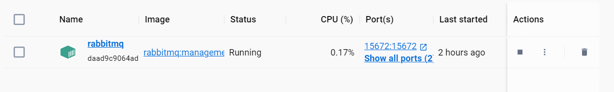

## Microservice Experiment

[TOC]

This project is built using [Nameko](https://nameko.readthedocs.io/en/stable/), a microservices framework for Python that lets you focus on writing your services without needing to worry about the underlying infrastructure. Our services communicate through a mix of HTTP and RPC, and we compare synchronous and asynchronous operations, as well as Redis and MySQL databases.

## Getting Started

These instructions will get you a copy of the project up and running on your local machine for development and testing purposes.

### Prerequisites

Before you start, ensure you have the following installed:

- Python 3.x
- [Docker](https://www.docker.com/) (optional, for running services in containers)
- [RabbitMQ](https://www.rabbitmq.com/) (Nameko uses RabbitMQ for service communication)

### Installing

Follow these steps to get your development environment running:

1. Clone the repository to your local machine:

   ```bash
   git clone https://github.com/KaitaoQiu/microservice_experiment.git
   ```

2. Navigate to the project directory:

   ```bash
   cd microservice_experiment
   ```

3. Install the required dependencies:

   ```bash
   pip install nameko, redis, mysql, aiomysql
   ```

4. Ensure RabbitMQ is running. 

   If you're using Docker, you can run:

   ```
   docker run -d -p 5672:5672 rabbitmq
   ```



### Running the Service

To run your Nameko service, use the `nameko run` command followed by your service module name. For example:

```bash
nameko run sync_service_y
```

Replace `sync_service_y` with the Python module where your service is defined.

## Running the Tests

This project uses pytest for testing. Test files are located in the `test_misc` directory.

To run the tests, navigate to the root of the project and execute:

```bash
cd test_misc
# for example, you want to add data into redis
python redis_add_random_data.py
# then, you can run cprofile to test cpu time and latency
python redis_cprofile_test.py
```

This will discover and run all the test cases defined in the `test_misc` directory.

## Service Interactions

### HTTP and RPC

- **HTTP Requests**: Our services use HTTP GET requests to query data from the customer table in a MySQL database. The response is returned in JSON format.
- **RPC Microservice**: We have a synchronous RPC microservice that interacts with a MySQL database. This service is used to compare its response with that of the HTTP service to ensure data consistency and integrity.

### Synchronous and Asynchronous Services

- **Synchronous Services**: We have a synchronous service (Service X) that reads data from an SQL database. This service is called by another synchronous service (Service Y) to process the data.
- **Asynchronous Services**: Asynchronous Service X establishes a connection to the aiomysql database. Asynchronous Service Y calls this service to process the data. We compare the processing times of synchronous and asynchronous operations to optimize our data handling.

### Redis and MySQL

- **Database Comparison**: Our synchronized service reads from two different databases, Redis and MySQL, to compare their performance and suitability for different types of data and operations within our microservices architecture.

## Built With

- [Nameko](https://nameko.readthedocs.io/en/stable/) - The microservices framework used
- [RabbitMQ](https://www.rabbitmq.com/) - Messaging broker
- [Redis](https://redis.io/) - In-memory data structure store, used as a database
- [MySQL](https://www.mysql.com/) - Open-source relational database management system

## License

This project is licensed under the MIT License - see the [LICENSE.md](https://chat.openai.com/c/LICENSE.md) file for details.